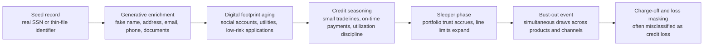

# The Synthetic Panopticon: Weaponized AI, Personal Identifiable Information (PII) Degradation, and the Multi-Layered Defense Role of Credit Bureaus

## Executive Summary

This white paper advances a blunt but now empirically supportable thesis: in modern financial services, traditional personally identifiable information such as name, date of birth, address, and Social Security number no longer functions as durable authentication material. At scale, those elements now behave more like searchable coordinates inside a hostile data market than like secrets possessed only by the legitimate customer. In the United States alone, the FTC received more than 1.1 million identity-theft reports in 2024, while FinCEN’s identity-focused review of Bank Secrecy Act filings found approximately 1.6 million identity-related reports in calendar year 2021, representing 42% of all filed reports and about $212 billion in suspicious activity. NIST’s current digital identity guidance now requires phishing-resistant options at AAL2 and makes clear that out-of-band mechanisms are not phishing-resistant, underscoring the architectural inadequacy of static-PII-plus-OTP designs under current adversary conditions.[1][3][5] citeturn4view2turn6view3turn12view0turn12view2

The operational problem has worsened because generative AI has industrialized impersonation. iProov reported a 704% increase in face-swap attacks from the first half to the second half of 2023; Entrust reported that deepfake attacks occurred every five minutes in 2024 and that digital document forgeries rose 244% year over year; Experian concluded that GenAI has materially increased the personalization and scale of fraud attacks over the prior 18 months. On the consumer side, FTC data show that imposter scams were the most-reported fraud category in 2024 and the second-largest loss category at $2.95 billion, while LexisNexis found scams accounted for 35% of fraud losses for North American financial institutions. The appropriate conclusion is not merely that fraud is growing, but that impersonation has become the dominant delivery system for identity crime across onboarding, authentication, social engineering, and account recovery.[1][7][12][13][14] citeturn4view1turn23view3turn34view0turn35view0turn36view0

The most consequential downstream expression of this shift is Synthetic Identity Fraud 2.0: identities seeded with real data, enriched by generative systems, aged through coordinated low-velocity activity, then monetized in synchronized bust-out events. Public benchmarks already show the scale. The Federal Reserve’s synthetic identity toolkit points to an estimated $20 billion in U.S. financial-institution losses in 2020, often miscategorized as credit loss; Experian’s 2024 global fraud report cites estimates that synthetic identities may account for up to 20% of loan and credit-card charge-offs, implying U.S. annual charge-off losses closer to $11 billion; TransUnion reported $3.2 billion in lender exposure to suspected synthetic identities across four U.S. tradeline categories in H1 2024; Equifax stated that the average charged-off loss per known synthetic identity in its files is approximately $13,000.[4][7][9][11] citeturn7view2turn24view0turn19view0turn20view2

Against this backdrop, the modern credit bureau is no longer adequately described as a backward-looking repository of repayment history. Public materials from Equifax, Experian, and TransUnion show that the large bureaus now expose fraud platforms that score identity, device, behavioral, and cross-network risk at the point of account opening and across the account lifecycle. Experian’s fraud stack explicitly combines device intelligence, biometrics, behavior metrics, document verification, and layered risk management on a cloud-based platform; TransUnion’s TruValidate orchestrates identity, device, and behavioral insights across digital and phone channels; Equifax’s Synthetic Identity Risk product applies AI to identity data, credit history, and behavioral signals both at origination and in account management. In short, the bureau function has expanded from retrospective credit memory to predictive identity-defense infrastructure.[8][9][11] citeturn30view0turn19view0turn33view0

The defense roadmap that follows is therefore layered by design. Enterprises should move from static customer verification to resistant, recursive identity assurance: high-integrity document validation, injection-resistant liveness, device and behavioral analytics, authoritative record corroboration where legally available, bureau data fusion, and phishing-resistant authentication for repeat access. For consumers, the rational posture is to restrict issuance channels wherever possible, monitor bureau-visible activity continuously, and replace phishable OTP-centered logins with passkeys or other phishing-resistant authenticators. FIDO’s passkey guidance and NIST’s latest identity framework both point in the same direction: challenge-response, origin-bound, public-key authentication is now the defensive baseline, not an optional enhancement.[5][15] citeturn12view0turn13view1

## Assumptions

The paper makes four working assumptions.

- **Time horizon.** Quantitative claims are weighted toward 2023–2026 sources because the fraud environment under discussion is changing rapidly, especially for deepfakes, digital-originations fraud, and passkey deployment.[1][7][10][11][13][14] citeturn4view1turn23view3turn19view2turn20view2turn35view0turn36view0
- **Geographic scope.** Threat evidence is global where the telemetry is strongest, but the institutional analysis centers on U.S. financial infrastructure because the bureau architecture, SSA verification rails, and FTC/FinCEN/FBI data are U.S.-specific.[1][2][3][6][10][11] citeturn4view1turn5view0turn6view3turn8view0turn19view2turn20view2
- **Interpretation of the “~700%” deepfake claim.** The most defensible original-source formulation is iProov’s measured 704% increase in face-swap attacks between H1 and H2 2023. That should be read as attack telemetry for a major deepfake vector, not as a universal census of all global fraud.[13] citeturn35view0
- **Disclosure limitations.** Public product pages from Equifax, Experian, and TransUnion disclose categories of signals and workflows, but they do not disclose full model features, thresholds, telecom-data provenance, or orchestration logic. Where the paper infers likely operating patterns from those disclosures, it labels the inference as such.[8][9][11] citeturn30view0turn19view0turn33view0

## The AI Era PII Degradation Paradigm

*Section 1.*

**Abstract & Executive Summary.** The degradation of PII is not merely a privacy problem; it is an assurance problem. When identity elements are widely breached, cheaply enriched, and trivially recombined, their entropy collapses for authentication purposes. FTC consumer reporting, FinCEN suspicious-activity analysis, and TransUnion breach telemetry together show a system in which identity data are repeatedly exposed, replayed, and repurposed. The correct architectural implication is that static PII should now be treated primarily as a lookup attribute that helps locate a record, not as persuasive evidence that the claimant is the rightful subject of that record. That proposition is an analytic inference from the current evidence base, rather than a single-source regulatory quote.[1][3][10] citeturn4view2turn6view3turn32view2

**The Mechanics of Attack.** Three developments have converged. First, deepfake media can now be generated and injected into onboarding and recovery workflows with industrial efficiency. iProov observed a 704% rise in face-swap attacks over one six-month interval and a 353% rise in emulator usage, meaning attackers are not only generating fake faces but also manipulating execution environments to evade detection. Entrust found that digital document forgery overtook physical counterfeits in 2024, accounting for 57% of all document fraud, while deepfake attacks occurred at a rate of one every five minutes. Second, voice phishing has become automatable: contemporary research shows that LLMs combined with text-to-speech and automatic speech recognition can power scalable vishing systems, while challenge-response work on real-time audio deepfakes shows why passive human recognition is unreliable as a standalone defense. Third, NIST’s current framework explicitly states that out-of-band authentication is not phishing-resistant and treats PSTN-based out-of-band mechanisms as restricted, with verifiers advised to consider risk indicators such as device swap, SIM change, and number porting. Taken together, these shifts have rendered interactive trust rituals based on “recognizing the voice,” “reading the selfie,” or “entering the code” strategically brittle.[5][13][14][16][17] citeturn12view2turn12view1turn35view0turn36view1turn39academia6turn39academia8

FIDO’s current passkey guidance supplies the corresponding control insight. OTP-based MFA remains widely deployed because it is cheap and familiar, but the alliance’s 2024 guidance notes that OTP systems are vulnerable because the generated secret is not cryptographically bound to the relying party session and can be intercepted or relayed. Passkeys, by contrast, use a public-key challenge-response mechanism scoped to the relying party’s domain, providing phishing resistance and replay resistance while reducing user dependence on recognizing social-engineering cues. That matters because the failure mode of AI-enabled identity attacks is not simply impersonation quality; it is the ability to force a victim or verifier into completing the attacker’s workflow for them.[5][15] citeturn12view0turn12view2turn13view1

**Quantifiable Market Risk.** The loss figures show why this has moved from a fraud-ops issue to a board-level solvency and compliance issue. FTC data show more than $12.5 billion in fraud losses in 2024, up 25% year over year. The most commonly reported scam category was imposter scams, and reported losses to imposter scams reached $2.95 billion. The FBI’s 2024 IC3 report attributed $13.7 billion in losses to cyber-enabled fraud alone, representing 83% of all 2024 losses reported to IC3. FinCEN’s identity-project analysis found that most institutions reported impersonation as their top identity exploitation typology and that identity-related reports totaled approximately $212 billion in suspicious activity. LexisNexis reported that every dollar lost to a fraudster cost North American financial institutions $4.41 once investigation, operations, and other downstream effects were included, and that scams comprised 35% of fraud losses. TransUnion, meanwhile, reported that 5% of all global digital transactions were suspected digital fraud in 2023 and that 13.5% of global digital account openings were suspected digital fraud. Across multiple taxonomies, the conclusion is consistent: impersonation-led fraud now dominates the exposure surface, and account opening is one of its most valuable entry points.[1][2][3][10][12] citeturn4view1turn5view0turn6view3turn32view3turn34view0

For publication layout, the most decision-useful companion visuals would be a log-scale line chart of deepfake-attack telemetry from iProov and Entrust, a stacked bar chart of FTC and FBI loss composition, and a bar-plus-line chart of TransUnion synthetic exposure against share of newly opened accounts. Those visualizations most directly illuminate attack acceleration, loss concentration, and origination-stage vulnerability.[1][2][11][13][14] citeturn4view1turn5view0turn20view2turn35view0turn36view1

| Attack technique | Why it defeats legacy controls | Modern control response | Primary evidence |
|---|---|---|---|
| Face swaps and injected deepfake video | Manual selfie or video review can be fooled, especially when emulator or metadata manipulation hides a virtual camera | Injection-resistant liveness detection, environment integrity checks, and secondary data corroboration | iProov and Entrust report rapid growth in face-swap and digital-document attacks; Experian notes deepfakes are materially affecting identity fraud.[7][13][14] citeturn23view3turn35view0turn36view1 |
| Voice cloning and AI vishing | Human “voice recognition” is weak; the attack can drive victims into approval or code relay flows | Known-channel callback, challenge-response, high-risk transaction holdbacks, phishing-resistant authenticators | NIST treats out-of-band mechanisms as non-phishing-resistant; recent research shows LLM+TTS+ASR can automate vishing.[5][16][17] citeturn12view2turn39academia6turn39academia8 |
| Static KBA using breached PII | Names, DOBs, SSNs, and addresses are heavily exposed and can be blended into synthetic identities | Treat PII as lookup data only; require authoritative and behavioral corroboration | FTC, FinCEN, Experian, and TransUnion all document large-scale identity exposure and synthetic-identity stress.[1][3][7][10] citeturn4view2turn6view3turn24view0turn32view2 |
| SMS or voice OTP | Codes are phishable, relayable, and subject to PSTN-related risk such as SIM swaps and number porting | Default to FIDO2/passkeys or other cryptographic, origin-bound authenticators | NIST restricts PSTN out-of-band usage and requires phishing-resistant options at AAL2; FIDO recommends displacing OTP with passkeys.[5][15] citeturn12view0turn12view1turn13view1 |

## The Re-Architected Threat

*Section 2.*

**Define Sleeper Fraud.** “Sleeper Fraud,” as used in this paper, refers to the latent stage of Synthetic Identity Fraud 2.0 in which a synthetic profile survives onboarding, accumulates low-friction evidence of legitimacy, receives line increases or expanded trust, and remains apparently quiet until the operator decides to monetize it. The identity itself is constructed by blending legitimate and false data. Equifax describes synthetic identity fraud as the coupling of real identity elements with manufactured components to create a fictitious consumer; Experian defines it as the creation of a fictitious identity that can include stolen or misused SSNs blended with fabricated information. The “sleeper” characteristic matters because the fraud signal is weakest when the model is only evaluating repayment appearance and strongest only after the criminal has already harvested trust.[8][9] citeturn19view0turn30view0

Experian’s 2024 global report shows how GenAI changes the lifecycle. It states that synthetic identity-related fraud is being accelerated by generative systems that can create highly realistic fake images, documents, and social-media profiles at scale. The same report notes that synthetic-ID data can be used to create accounts en masse and leave them dormant until fraudsters need to move funds. This is the core design change from earlier synthetic fraud waves: the criminal no longer needs to handcraft every corroborating trace. GenAI lowers the cost of the identity’s supporting narrative, meaning the attacker can spend more effort on orchestration and timing.[7] citeturn24view0

The lifecycle above synthesizes the public evidence from Experian, Equifax, the Federal Reserve, and TransUnion on synthetic construction, dormancy, portfolio seasoning, and final bust-out monetization.[4][7][9][11] citeturn7view3turn24view0turn19view0turn20view2

**The AI Accumulation Engine.** The accumulation engine is the link between GenAI and financial loss. In public disclosures, Experian emphasizes that synthetic attackers now use fake images, documents, and social profiles at scale, and that defenders increasingly need device and behavioral intelligence because the decisive signal is often not just the application data but the method of interaction with the digital form. That observation supports a broader inference: once a low-cost generative stack can create artifacts, write plausible bios, populate websites, produce utility-like documents, and vary interaction style, an attacker can begin to age the identity’s ecosystem rather than merely the tradeline. This is why the synthetic identity problem is no longer only a credit-file problem. It is an ecosystem-consistency problem spanning application data, device history, channel behavior, and portfolio evolution.[7][8][11] citeturn24view0turn31view2turn33view0

**The Bust-Out Vulnerability.** The eventual monetization step is financially asymmetric. Public estimates vary, but they all point in the same direction. The Federal Reserve’s toolkit cites an estimated $20 billion in U.S. financial-institution losses in 2020, often miscategorized as credit loss. Experian’s 2024 global fraud report cites estimates that synthetic identity fraud could account for up to 20% of loan and credit-card charge-offs, implying U.S. annual charge-off losses closer to $11 billion. TransUnion reported that lender exposure to suspected synthetic identities across U.S. auto loans, bankcards, retail credit cards, and unsecured personal loans rose from $3.0 billion in H1 2023 to $3.2 billion in H1 2024, and that 0.20% of newly opened accounts across those tradelines were associated with synthetic identities in H1 2024. Equifax further reported that the average charged-off loss per known synthetic identity in its data is about $13,000. A conventional credit-risk model that rewards seasoning, low delinquency, and orderly utilization can therefore become the mechanism through which the attack earns its final payoff.[4][7][9][11] citeturn7view2turn24view0turn19view0turn20view2

| Financial impact lens | Public benchmark | Why it matters for CROs |
|---|---|---|
| Per-known-synthetic tradeline loss | Approx. **$13,000** average charged-off loss per known synthetic identity in Equifax data | Shows that even when a synthetic is eventually identified, the unit economics are already meaningful.[9] citeturn19view0 |
| Observed lender exposure | **$3.2 billion** exposure to suspected synthetic identities across four U.S. tradeline categories in H1 2024 | Demonstrates that exposure is already visible at portfolio scale, not just in anecdotal cases.[11] citeturn20view2 |
| U.S. annual charge-off estimate | Up to **$11 billion** annual U.S. charge-off losses if synthetic identities account for up to 20% of loan and credit-card charge-offs | Frames the likely magnitude if misclassification is corrected.[7] citeturn24view0 |
| Broader U.S. institutional loss benchmark | Estimated **$20 billion** in 2020, often miscategorized as credit loss | Indicates that the accounting taxonomy itself may understate fraud exposure.[4] citeturn7view2 |
| Downstream cost multiplier | **$4.41** total cost per direct fraud dollar for North American financial institutions | Converts charge-off thinking into enterprise-cost thinking, including investigation and operational burden.[12] citeturn34view0 |

## The Defensive Wall

*Section 3.*

**Shift from Reactive to Proactive Analytics.** The large bureaus’ current public materials show a structural shift away from the narrow function of historical-file management. Experian now describes a cloud-based fraud-management platform that combines machine-learning analytics with proprietary and partner data, device intelligence, biometrics, behavior metrics, OTPs, and document verification. TransUnion’s TruValidate similarly positions itself as an orchestration layer for identity, device, and behavioral insights across channels. Equifax’s Synthetic Identity Risk product uses AI to analyze identity data, credit history, and behavioral signals and can be deployed both at account opening and for ongoing account management. The practical implication is that bureau data are increasingly being used as part of an active decision fabric rather than only as a retrospective reference set.[8][9][11] citeturn30view0turn19view0turn33view0

**Cross-Network Behavioral Signals.** The distinctive advantage of the bureau layer is not simply the presence of more data; it is the ability to join otherwise fragmented signals. Experian explicitly highlights behavior metrics, behavioral analytics, bust-out prediction, identity resolution, layered risk management, and synthetic identity protection. TransUnion states that TruValidate can verify consumer identity against robust datasets, assess anonymous-user risk with digital insights, use advanced device intelligence, and detect potential fraud with custom analytics. Equifax states that its synthetic-ID product considers identity data, credit history, and behavioral signals together, which is precisely the fusion traditional point controls lack. In all three cases, the public descriptions focus on real-time or near-real-time decision support at origination or at critical lifecycle events, not just after-the-fact dispute resolution.[8][9][11] citeturn31view2turn19view0turn33view0

| Bureau | Public product example | Signals publicly disclosed | Lifecycle timing | Strategic implication |
|---|---|---|---|---|
| **Equifax** | **Synthetic Identity Risk** | Identity data, credit history, behavioral signals, AI scoring | Account opening and ongoing account management | Designed to surface hidden synthetic risk before or during portfolio growth, not only after charge-off.[9] citeturn19view0 |
| **Experian** | **Fraud management / synthetic identity protection stack** | Cloud-based orchestration, device intelligence, biometrics, behavior metrics, document verification, behavioral analytics, bust-out prediction, layered risk management | Origination, authentication, step-up events, portfolio surveillance | Indicates convergence of fraud, identity, and credit-risk operations around a multilayer platform.[8] citeturn30view0turn31view2 |
| **TransUnion** | **TruValidate** | Identity, device, and behavioral insights; identity insights; digital insights; omnichannel authentication; fraud analytics; advanced device intelligence | Cross-channel account opening, digital interaction, and phone-channel authentication | Evidences a bureau-administered decision layer that evaluates trust before the account is fully established.[11] citeturn33view0 |

**The Definitive Identity Verification Layer.** The public evidence also clarifies what the bureau stack can and cannot do on its own. Bureau analytics materially improve risk prediction, but authoritative identity corroboration still matters. In the U.S., SSA’s eCBSV service allows permitted entities, with written consent, to verify whether an SSN, name, and date-of-birth combination matches Social Security records and to receive a yes/no result with mismatch explanations. That is the clearest public example of an authoritative registry check referenced in this paper. NIST’s latest identity guidance complements this by allowing fraud indicators to lower the risk of misauthentication while emphasizing that such indicators do not substitute for an authentication factor. The strongest architecture, therefore, is layered: authoritative core-data corroboration where legally available, bureau-file and cross-network evaluation, device and behavioral analytics, and phishing-resistant authentication for continuing access.[5][6] citeturn8view0turn12view0

One limitation should be stated directly. The public documents cited here do not fully enumerate every government or telecom registry connection used by the bureaus or their partners. What they do disclose is still substantial: Experian says its stack leverages device intelligence, one-time-password flows, behavior metrics, document verification, and partner data; TransUnion says TruValidate orchestrates identity, device, and behavioral insights across digital and phone channels; Equifax says its synthetic product analyzes identity, credit, and behavioral data. Those disclosures are sufficient to conclude that the bureau role has expanded to cross-source identity defense, even if vendor-specific upstream connections remain commercially opaque.[8][9][11] citeturn31view3turn19view0turn33view0

## The Hybrid Security Roadmap

*Section 4.*

**Enterprise Controls.** The central architectural mistake in many enterprises is still linear verification: document, selfie, OTP, decision. Against AI-enabled fraud, identity assurance must instead be recursive and layered across onboarding, access, payment, and account management. NIST requires phishing-resistant options at AAL2 and phishing-resistant authenticators at AAL3; FIDO recommends displacing password-plus-OTP flows with passkeys because passkeys are origin-bound, replay-resistant, and cryptographic; the bureau product stack shows that identity, device, and behavior data can be fused in real time; and the SSA eCBSV service shows how authoritative U.S. registry corroboration can be inserted into the flow when legal prerequisites are met.[5][6][8][11][15] citeturn12view0turn8view0turn30view0turn33view0turn13view1

| Maturity layer | Required enterprise controls | Why the layer exists |
|---|---|---|
| **Foundational** | Retire KBA-only and SMS-only high-risk flows; add device risk, behavioral signals, breach-aware identity checks, and bureau-assisted risk evaluation | NIST now treats phishable out-of-band flows as insufficient for strong assurance; synthetic-ID formation already exploits static data abundance.[5][7][8] citeturn12view1turn24view0turn31view2 |
| **Managed** | Add document verification, resistant liveness detection, and authoritative core-data corroboration where eligible; integrate bureau and partner data at origination | Deepfake documents and injected media now target the onboarding moment directly, making image-only review inadequate.[6][8][13][14] citeturn8view0turn31view3turn35view0turn36view1 |
| **Adaptive** | Orchestrate identity, device, behavioral, and portfolio signals continuously; score bust-out and synthetic risk across the lifecycle; converge fraud and credit-risk teams | Public bureau materials and Experian’s report both stress that bust-out and synthetic identity cannot be isolated to onboarding alone.[7][8][9][11] citeturn24view0turn30view0turn19view0turn33view0 |
| **Resilient** | Make passkeys or equivalent phishing-resistant authenticators the default for repeat access and sensitive recovery; require secondary verification for high-value changes requested via phone or video | This removes the attacker’s easiest relay channel and sharply reduces OTP-driven social-engineering success.[5][15][16][17] citeturn12view0turn13view1turn39academia6turn39academia8 |

A practical implementation sequence follows from the table. At onboarding, the enterprise should validate the credential artifact, validate the presenting person, validate the application environment, and validate the claimed identity against external data. During account use, the enterprise should continue validating behavioral continuity, device continuity, limit-exposure growth, and cross-channel anomalies. At account recovery, the enterprise should assume the channel is compromised until independently proven otherwise. That is the operational expression of a multi-layered identity framework: not a single “proof,” but a chain of mutually constraining checks.[5][8][11] citeturn12view0turn31view2turn33view0

**Consumer Autonomy Frameworks.** For consumers, the rational defensive model is issuance restriction plus visibility plus phishing resistance. Issuance restriction means treating new-account creation as the highest-risk moment and using persistent credit freezes whenever constant open-origination availability is not actually required. Visibility means active monitoring of bureau-visible activity, prompt challenge of unfamiliar inquiries or newly opened tradelines, and suspicion of any unsolicited request to “verify” identity by sharing codes, documents, or payment instructions. Phishing resistance means replacing SMS-centered MFA wherever possible with passkeys or other FIDO-aligned authenticators, because passkeys bind the login cryptographically to the legitimate domain and are specifically intended to displace OTP flows.[5][10][11][15] citeturn12view0turn19view2turn20view2turn13view1

Consumers should also adapt to voice and video deception as a daily operating assumption. Because out-of-band authentication is not phishing-resistant, and because AI-assisted voice impersonation can be scaled, the safest pattern for material requests is to terminate the interaction and re-establish contact through a previously trusted channel. In family and executive contexts alike, prearranged callback discipline and challenge words now have the same strategic role that password managers and hardware security keys played in earlier phishing eras: they create a separate trust anchor outside the attacker’s generated content.[5][16][17] citeturn12view2turn39academia6turn39academia8

**Open questions / limitations.** First, the public bureau materials disclose enough to show the shift toward predictive identity defense, but not enough to audit model fairness, false-positive tradeoffs, or exact upstream registry integrations. Second, the most dramatic deepfake-growth figures come from original-source vendor telemetry, not a single global public census; they are still useful, but they should be read as high-signal operational indicators rather than universal prevalence measurements. Third, the target-state recommendation for cryptographically stronger identity proofing is clearer on the authentication side than on the document side, because public deployment of signed digital-credential ecosystems remains uneven across jurisdictions.[8][9][11][13][14][15] citeturn30view0turn19view0turn33view0turn35view0turn36view1turn13view1

**Reference index.**

[1] Federal Trade Commission, *New FTC Data Show a Big Jump in Reported Losses to Fraud to $12.5 Billion in 2024* (March 10, 2025). citeturn4view0turn4view1turn4view2

[2] FBI Internet Crime Complaint Center, *2024 Internet Crime Report*. citeturn5view0turn5view1turn5view2

[3] FinCEN, *FinCEN Issues Analysis of Identity-Related Suspicious Activity* (January 9, 2024). citeturn6view3turn6view2

[4] Federal Reserve Banks, *Synthetic Identity Fraud Mitigation Toolkit*. citeturn7view2turn7view3

[5] NIST, *SP 800-63-4 Digital Identity Guidelines* and *SP 800-63B*. citeturn10view0turn12view0turn12view1turn12view2

[6] Social Security Administration, *eCBSV Home*. citeturn8view0

[7] Experian, *Global Identity & Fraud Report 2024*. citeturn23view1turn23view3turn24view0

[8] Experian, *Enterprise Fraud Management Solutions & Services*. citeturn30view0turn31view2turn31view3

[9] Equifax, *Equifax Introduces Enhanced Synthetic Identity Fraud Detection* (January 23, 2026). citeturn19view0

[10] TransUnion, *H1 2024 Update: State of Omnichannel Fraud Report*. citeturn19view2turn32view2turn32view3

[11] TransUnion, *Fraud Costing Businesses Nearly 7% of Revenues* newsroom analysis and *TruValidate* product page. citeturn20view2turn20view3turn33view0

[12] LexisNexis Risk Solutions, *True Cost of Fraud Study* press release (April 24, 2024). citeturn34view0

[13] iProov, *New Threat Intelligence Report Exposes the Impact of Generative AI on Remote Identity Verification* (February 7, 2024). citeturn35view0

[14] Entrust, *Deepfake Attacks Strike Every Five Minutes Amid 244% Surge in Digital Document Forgeries* (November 19, 2024). citeturn36view0turn36view1turn36view2

[15] FIDO Alliance, *Displace Password + OTP Authentication with Passkeys* (September 17, 2024). citeturn13view1

[16] Mittal et al., *PITCH: AI-assisted Tagging of Deepfake Audio Calls using Challenge-Response* (2024). citeturn39academia6

[17] Grabovski et al., *ASRJam: Human-Friendly AI Speech Jamming to Prevent Automated Phone Scams* (2025). citeturn39academia8
